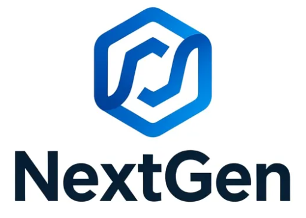

# NextGen – Multi-Tenant Website Builder

NextGen is a **multi-tenant website builder** (WordPress/Webflow–style) built with **Next.js** and **ASP.NET Core**.  
Each site is served via its own **subdomain**, has its own pages, schema-driven layout, and an admin dashboard for managing content.

The platform is designed around:

- JSON-based page schemas
- A visual page builder
- Subdomain-based site resolution
- Secure cookie-based authentication
- A modern SaaS-style admin dashboard

---

## Features

- 🧩 **Schema-driven page rendering**
- 🌐 **Subdomain-based multi-tenancy** (`site.test.home`)
- 🛠 **Admin dashboard per site** (`/admin`)
- 📄 **Page management** (draft / published)
- 🔐 **Cookie-based authentication (HttpOnly)**
- ⚡ **Next.js App Router + Server Components**
- 🧠 **ASP.NET Core backend with Identity**

---

## Tech Stack

### Frontend

- **Next.js (App Router)**
- **TypeScript**
- **React**
- **Tailwind CSS**
- **TanStack Query**
- **shadcn/ui**

### Backend

- **ASP.NET Core**
- **Entity Framework Core**
- **ASP.NET Identity**
- **JWT (stored in HttpOnly cookies)**

---
